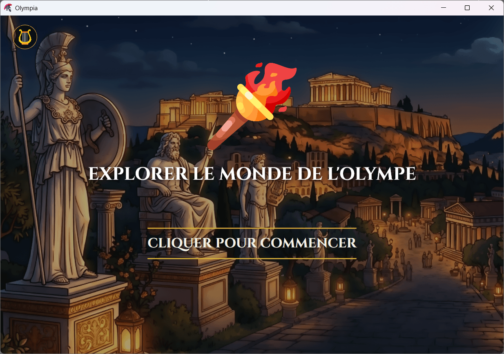
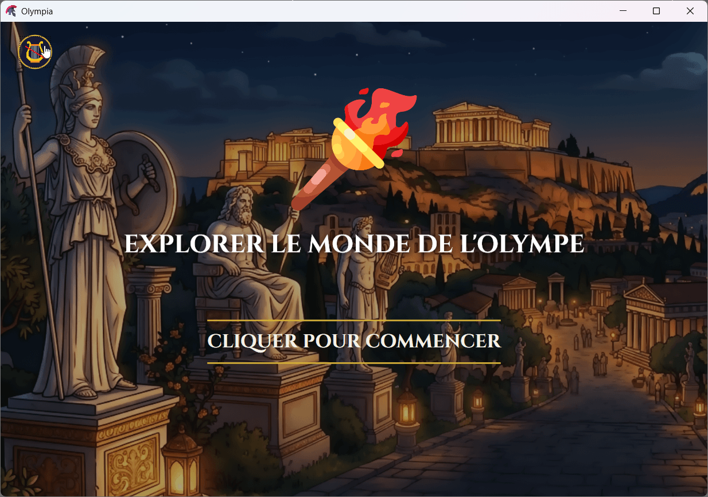
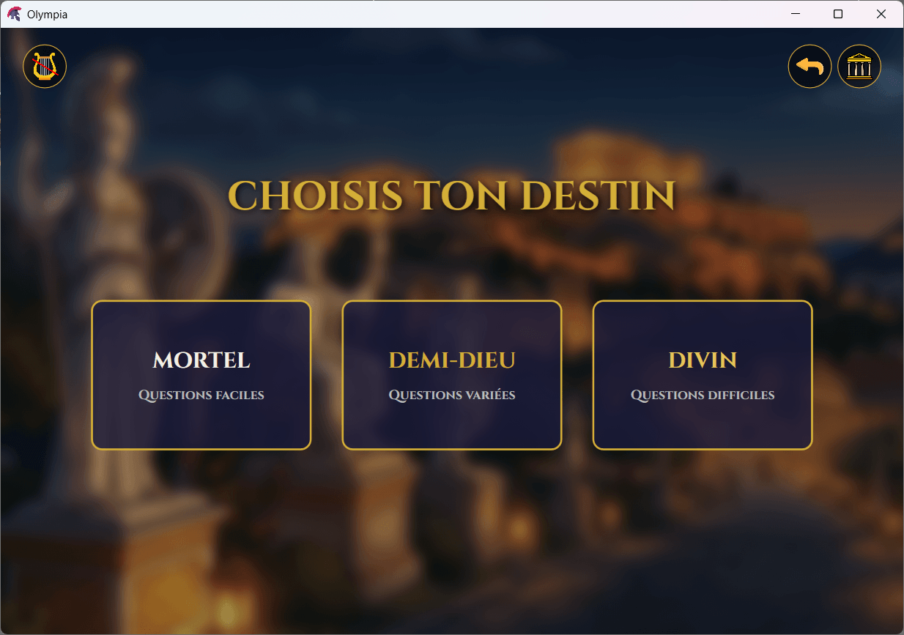
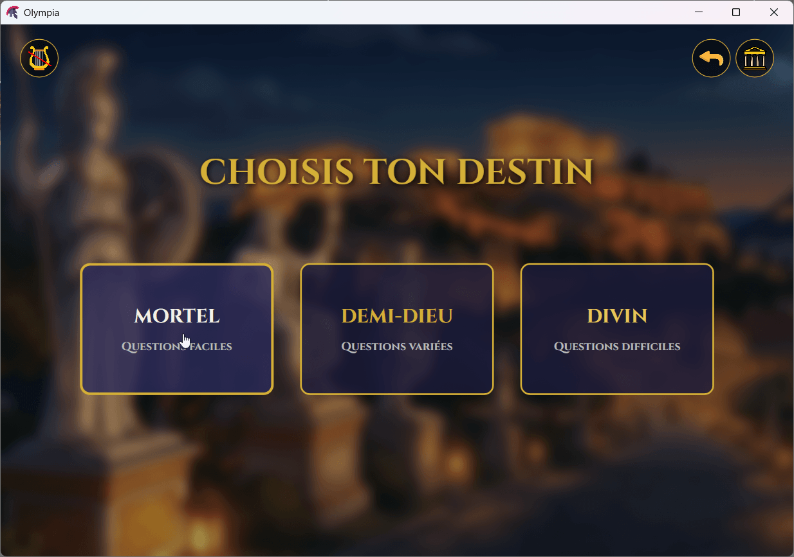
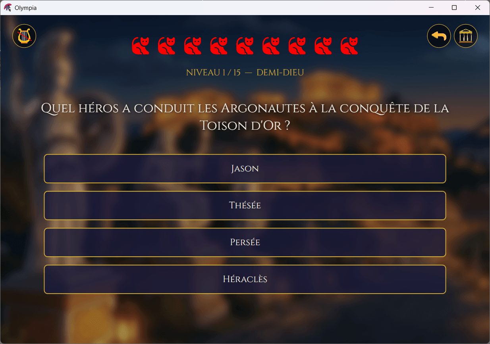
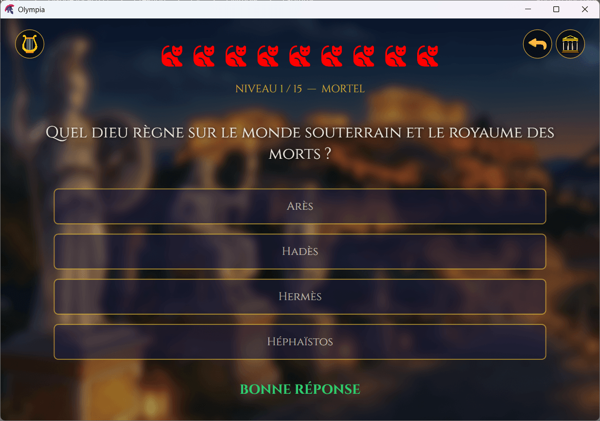
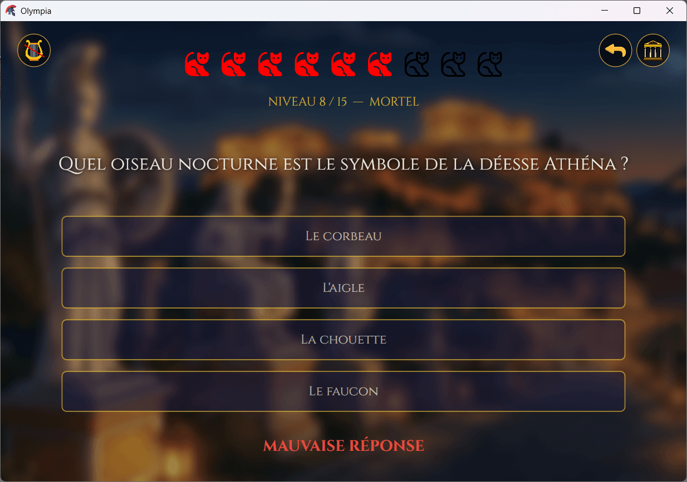
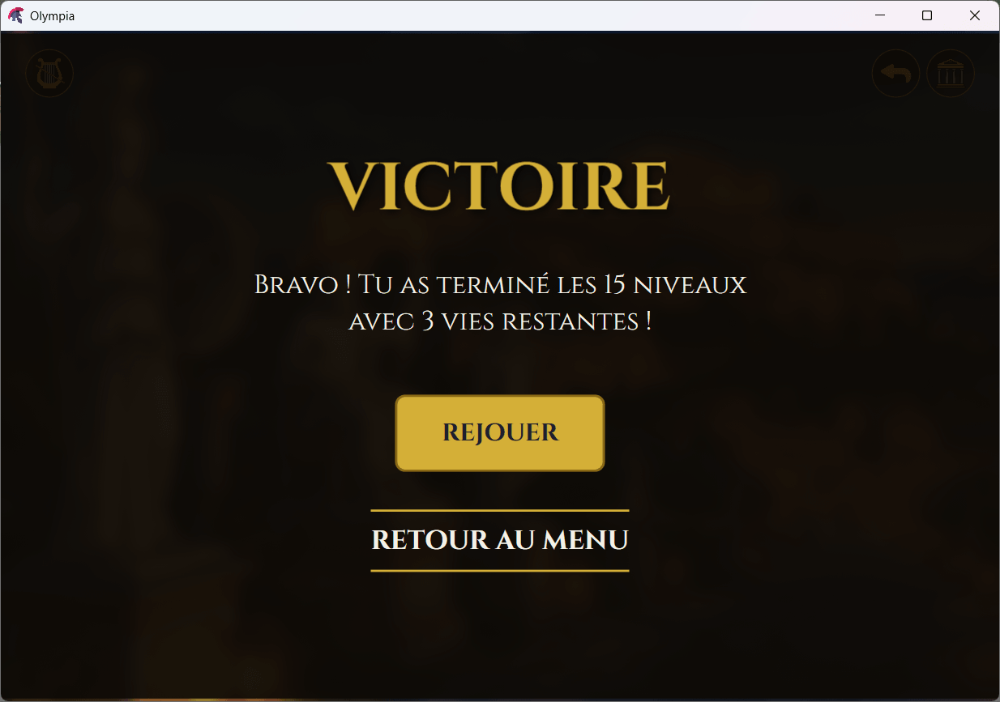

# 🏛️ Olympia - Quiz Mythologie Grecque

Jeu de quiz Windows sur la **mythologie grecque**, développé en **C#** avec **WPF** et **.NET 8.0**.

Testez vos connaissances sur les dieux, héros et créatures de l'Olympe à travers 60 questions réparties en 3 niveaux de difficulté.

---

## 🎮 Fonctionnalités

- 🏛️ **60 questions** sur la mythologie grecque (dieux, héros, monstres, lieux)
- 🎯 **3 niveaux de difficulté** : Mortel, Demi-Dieu, Divin
- ❤️ **9 vies** représentées par des chats
- 🎵 **Musique de fond** en boucle avec bouton mute/unmute
- ✨ **Animations fluides** : transitions en fondu, effet pulse sur les bonnes réponses
- ⏱️ **Auto-passage** : la question suivante s'affiche automatiquement après 1,2 s
- 🎨 **Style grec antique** : police Cinzel, palette or/marbre/bleu Égée
- 🖼️ **Interface adaptative** : s'adapte à toutes les tailles de fenêtre
- 📦 **Exe autonome** : un seul fichier à distribuer

---

## 📸 Captures d'écran

| Écran                                   | Description                                             |
| --------------------------------------- | ------------------------------------------------------- |
|  | **Menu principal** - Explorer le monde de l'Olympe      |
|  | **Menu principal** - Explorer le monde de l'Olympe      |
|  | **Choix de la difficulté** - Interface de jeu avec vies |
|  | **Choix de la difficulté** - Interface de jeu avec vies |
|  | **Question de quiz** - Interface de jeu avec vies       |
|  | **Bonne réponse** - Affichage en vert                   |
|  | **Mauvaise réponse** - Affichage en rouge               |
|  | **Écran de score** - Fin de partie terminée             |

---

## 🛠️ Prérequis

Avant de commencer, assurez-vous d'avoir installé :

| Outil                    | Version minimale | Téléchargement                                                  |
| ------------------------ | ---------------- | --------------------------------------------------------------- |
| **.NET SDK**             | 8.0              | [Télécharger](https://dotnet.microsoft.com/download)            |
| **.NET Desktop Runtime** | 8.0              | [Télécharger](https://dotnet.microsoft.com/download/dotnet/8.0) |
| **Visual Studio**        | 2022             | [Télécharger](https://visualstudio.microsoft.com/)              |

> ⚠️ Pour exécuter l'exe publié, seul le **.NET 8 Desktop Runtime** est nécessaire.

---

## 📥 Installation

### 1️⃣ Cloner le projet

```bash
git clone https://github.com/Johanes-mg/Olympia.git
cd Olympia
```
